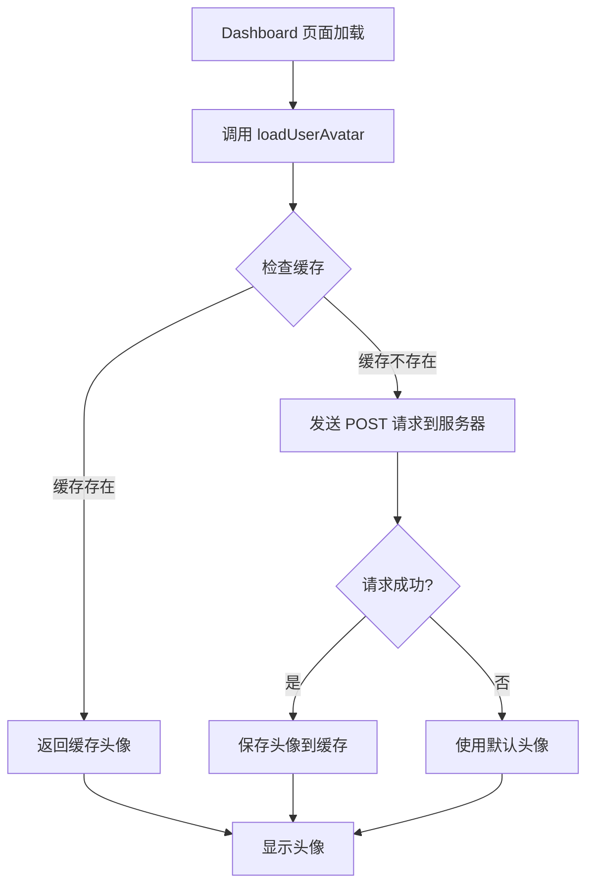

# 头像加载功能实现指南

## 概述

本项目已实现完整的头像加载功能，支持从后端获取、本地缓存和自动显示。

## 功能特性

1. **自动加载** - 页面加载时自动获取用户头像
2. **智能缓存** - 头像数据缓存 24 小时，减少服务器请求
3. **Base64 格式** - 支持 Base64 编码的图片数据
4. **降级处理** - 无头像时显示默认字母头像
5. **统一接口** - 所有头像相关操作集中在 `avatar.js` 工具中

## API 接口

### 获取头像

**请求**
```http
POST /api/profile/avatar/get HTTP/1.1
Host: localhost:8835
Authorization: Bearer <JWT_TOKEN>
Content-Type: application/json
```

**响应**
```json
{
  "code": 200,
  "success": true,
  "message": "获取成功（来自缓存）",
  "avatar": "iVBORw0KGgoAAAANSUhEUgAA..."
}
```

## 文件结构

### 1. API 配置 - `src/config/api.js`

```javascript
export const PROFILE_API = {
  GET_AVATAR: `${BASE_API_URL}/profile/avatar/get`,
  UPLOAD_AVATAR: `${BASE_API_URL}/profile/avatar/upload`,
  DELETE_AVATAR: `${BASE_API_URL}/profile/avatar/delete`
}
```

### 2. 头像工具 - `src/utils/avatar.js`

提供以下核心函数：

| 函数 | 说明 | 返回值 |
|------|------|--------|
| `fetchAvatarFromServer()` | 从服务器获取头像 | `Promise<string|null>` |
| `getAvatarFromCache()` | 从缓存获取头像 | `string|null` |
| `getUserAvatar()` | 获取头像（优先缓存） | `Promise<string|null>` |
| `base64ToDataUrl()` | Base64 转 Data URL | `string` |
| `updateAvatarCache()` | 更新头像缓存 | `void` |
| `clearAvatarCache()` | 清除头像缓存 | `void` |

### 3. 已集成的页面

- ✅ [DashBoardView.vue](file:///C:/Users/ROG/Desktop/develop/FrontEnd/CloudFileSystem/src/views/DashBoardView.vue) - 仪表盘头像显示
- ✅ [ProfileEditView.vue](file:///C:/Users/ROG/Desktop/develop/FrontEnd/CloudFileSystem/src/views/ProfileEditView.vue) - 个人信息页头像编辑

## 使用方法

### 在组件中加载头像

```vue
<script setup>
import { ref, onMounted } from 'vue'
import { getUserAvatar, base64ToDataUrl } from '@/utils/avatar'

const userAvatar = ref('')

onMounted(async () => {
  // 加载头像
  const avatarData = await getUserAvatar()
  if (avatarData) {
    userAvatar.value = base64ToDataUrl(avatarData)
  }
})
</script>

<template>
  <div class="avatar">
    
    <div v-else class="default-avatar">U</div>
  </div>
</template>
```

### 上传新头像后更新缓存

```javascript
import { updateAvatarCache } from '@/utils/avatar'

// 用户上传新头像后
const handleAvatarUpload = async (file) => {
  // ... 上传逻辑
  
  // 更新本地缓存
  updateAvatarCache(newAvatarBase64)
}
```

### 退出登录时清除缓存

```javascript
import { clearAvatarCache } from '@/utils/avatar'

const handleLogout = () => {
  clearAuthInfo()
  clearAvatarCache()  // 清除头像缓存
  router.push('/login')
}
```

## 缓存机制

### 缓存策略

- **缓存位置**: `localStorage`
- **缓存键**: 
  - `user_avatar_cache` - 头像 Base64 数据
  - `user_avatar_timestamp` - 缓存时间戳
- **缓存有效期**: 24 小时

### 缓存流程

```
1. 页面加载
   ↓
2. 检查缓存是否存在且未过期
   ↓
   ├─ 是 → 使用缓存头像
   │
   └─ 否 → 从服务器获取
          ↓
       保存到缓存
          ↓
       显示头像
```

## 工作流程

### Dashboard 页面加载头像



### Profile 页面加载头像

与 Dashboard 相同，但额外支持：
- 头像预览
- 头像上传
- 头像删除

## 错误处理

### 1. 无 JWT 令牌

```javascript
logger.warn('未找到 JWT 令牌，无法获取头像')
return null
```

### 2. 网络请求失败

```javascript
logger.error('获取头像请求失败，HTTP 状态码:', response.status)
return null
```

### 3. 服务器返回错误

```javascript
logger.warn('获取头像失败:', result.message)
return null
```

### 4. 图片加载失败

```vue


<script>
const handleImageError = () => {
  logger.warn('头像加载失败，使用默认头像')
  userAvatar.value = ''
}
</script>
```

## 最佳实践

### ✅ 推荐做法

1. **始终使用 `getUserAvatar()`**
   ```javascript
   // ✅ 好 - 自动处理缓存
   const avatar = await getUserAvatar()
   
   // ❌ 不好 - 每次都请求服务器
   const avatar = await fetchAvatarFromServer()
   ```

2. **使用 `base64ToDataUrl()` 转换**
   ```javascript
   // ✅ 好 - 兼容不同格式
   userAvatar.value = base64ToDataUrl(avatarData)
   
   // ❌ 不好 - 可能缺少前缀
   userAvatar.value = `data:image/png;base64,${avatarData}`
   ```

3. **退出时清除缓存**
   ```javascript
   // ✅ 好 - 保护用户隐私
   clearAuthInfo()
   clearAvatarCache()
   ```

### ❌ 避免的做法

1. **不要直接访问 localStorage**
   ```javascript
   // ❌ 避免
   const avatar = localStorage.getItem('user_avatar_cache')
   
   // ✅ 使用
   const avatar = getAvatarFromCache()
   ```

2. **不要忘记错误处理**
   ```javascript
   // ❌ 避免
   const avatar = await getUserAvatar()
   userAvatar.value = avatar
   
   // ✅ 使用
   try {
     const avatar = await getUserAvatar()
     userAvatar.value = avatar || ''
   } catch (error) {
     logger.error('加载头像失败:', error)
     userAvatar.value = ''
   }
   ```

## 扩展功能

### 未来可以添加的功能

1. **头像裁剪** - 上传前裁剪图片
2. **多尺寸支持** - 缩略图、中等、大尺寸
3. **进度显示** - 上传进度条
4. **格式转换** - 自动转换为 WebP 格式
5. **CDN 集成** - 使用 CDN 加速头像加载

## 调试技巧

### 查看缓存状态

```javascript
console.log('头像缓存:', localStorage.getItem('user_avatar_cache'))
console.log('缓存时间:', localStorage.getItem('user_avatar_timestamp'))
```

### 强制刷新头像

```javascript
// 清除缓存后重新加载
clearAvatarCache()
const avatar = await getUserAvatar()
```

### 检查日志输出

在浏览器控制台查看：
```
[2026-04-27 14:30:25.123] [INFO] [Avatar] 正在从服务器获取头像...
[2026-04-27 14:30:25.456] [INFO] [Avatar] 头像获取成功
[2026-04-27 14:30:25.789] [INFO] [DashboardView] 头像加载成功
```

---

**最后更新**: 2026-04-27  
**维护者**: 开发团队
