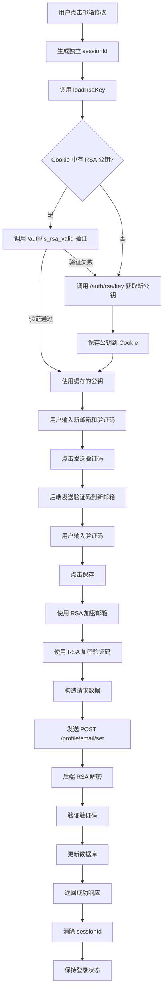
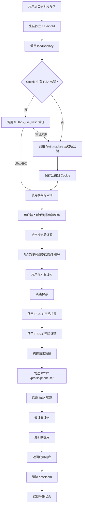
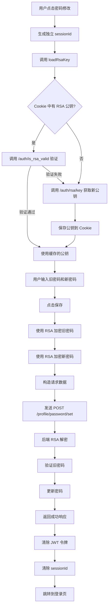

# 邮箱、手机号、密码修改 RSA 加密实现指南

## 📋 概述

本文档详细说明 ProfileEditView 中邮箱、手机号、密码修改功能的 RSA 加密实现，确保所有敏感数据在传输过程中都经过加密保护。

---

## ✅ 已完成的改造

### 1. **startEdit 函数增强**

**位置**: `ProfileEditView.vue` - 第 730-778 行

#### 改造前

```javascript
const startEdit = async (field) => {
  // ... 其他逻辑
  
  if (field === 'email') {
    editForm.value.email = userInfo.value.email || ''
    editForm.value.emailVerificationCode = ''
    emailSessionId.value = getOrCreatePurposeSessionId('email')
    logger.info('邮箱修改专用 sessionId:', emailSessionId.value)
    // ❌ 没有获取 RSA 密钥
  } else if (field === 'phone') {
    editForm.value.phone = userInfo.value.phone || ''
    editForm.value.phoneVerificationCode = ''
    phoneSessionId.value = getOrCreatePurposeSessionId('phone')
    logger.info('手机号修改专用 sessionId:', phoneSessionId.value)
    // ❌ 没有获取 RSA 密钥
  } else if (field === 'password') {
    // ... 
    await loadRsaKey()  // ✅ 只有密码修改获取了 RSA 密钥
  }
}
```

#### 改造后

```javascript
const startEdit = async (field) => {
  // ... 其他逻辑
  
  if (field === 'email') {
    editForm.value.email = userInfo.value.email || ''
    editForm.value.emailVerificationCode = ''
    emailSessionId.value = getOrCreatePurposeSessionId('email')
    logger.info('邮箱修改专用 sessionId:', emailSessionId.value)
    
    // ✅ 获取并验证 RSA 密钥
    logger.info('开始获取 RSA 密钥用于邮箱修改...')
    await loadRsaKey()
  } else if (field === 'phone') {
    editForm.value.phone = userInfo.value.phone || ''
    editForm.value.phoneVerificationCode = ''
    phoneSessionId.value = getOrCreatePurposeSessionId('phone')
    logger.info('手机号修改专用 sessionId:', phoneSessionId.value)
    
    // ✅ 获取并验证 RSA 密钥
    logger.info('开始获取 RSA 密钥用于手机号修改...')
    await loadRsaKey()
  } else if (field === 'password') {
    // ...
    await loadRsaKey()  // ✅ 保持不变
  }
}
```

**改进**：
- ✅ 邮箱修改时自动获取 RSA 密钥
- ✅ 手机号修改时自动获取 RSA 密钥
- ✅ 密码修改时保持原有逻辑

---

### 2. **邮箱修改 RSA 加密**

**位置**: `ProfileEditView.vue` - `saveField()` 函数中的邮箱部分（第 1060-1130 行）

#### 改造前

```javascript
if (field === 'email') {
  const newEmail = editForm.value.email
  const emailCode = editForm.value.emailVerificationCode
  
  // ... 验证逻辑
  
  // ❌ 明文传输
  const requestData = {
    sessionId: emailSessionId.value,
    email: newEmail,              // 明文
    verificationCode: emailCode   // 明文
  }
  
  logger.info('发送邮箱修改请求:', requestData)
  
  const response = await fetch(PROFILE_API.SET_EMAIL, {
    method: 'POST',
    headers: {
      'Content-Type': 'application/json',
      'Authorization': `Bearer ${token}`
    },
    body: JSON.stringify(requestData)
  })
  
  // ... 处理响应
}
```

#### 改造后

```javascript
if (field === 'email') {
  const newEmail = editForm.value.email
  const emailCode = editForm.value.emailVerificationCode
  
  // ... 验证逻辑
  
  // ✅ 检查 RSA 密钥是否存在
  if (!rsaPublicKey.value) {
    logger.warn('RSA 密钥未加载，尝试重新获取...')
    await loadRsaKey()
    
    if (!rsaPublicKey.value) {
      alert('系统初始化失败，请刷新页面重试')
      return
    }
  }
  
  // ✅ 使用 RSA 加密邮箱和验证码
  const encryptedEmail = encryptPassword(newEmail, rsaPublicKey.value)
  const encryptedCode = encryptPassword(emailCode, rsaPublicKey.value)
  
  // ✅ 构造请求数据（使用 RSA 加密）
  const requestData = {
    sessionId: emailSessionId.value,
    email: encryptedEmail,              // RSA 加密
    verificationCode: encryptedCode     // RSA 加密
  }
  
  logger.info('发送邮箱修改请求（RSA 加密）:', { sessionId: emailSessionId.value })
  
  const response = await fetch(PROFILE_API.SET_EMAIL, {
    method: 'POST',
    headers: {
      'Content-Type': 'application/json',
      'Authorization': `Bearer ${token}`
    },
    body: JSON.stringify(requestData)
  })
  
  // ... 处理响应
}
```

**改进**：
- ✅ 添加 RSA 密钥检查
- ✅ 邮箱地址使用 RSA 加密
- ✅ 验证码使用 RSA 加密
- ✅ 日志中不记录敏感信息

---

### 3. **手机号修改 RSA 加密**

**位置**: `ProfileEditView.vue` - `saveField()` 函数中的手机号部分（第 1131-1201 行）

#### 改造前

```javascript
if (field === 'phone') {
  const newPhone = editForm.value.phone
  const phoneCode = editForm.value.phoneVerificationCode
  
  // ... 验证逻辑
  
  // ❌ 明文传输
  const requestData = {
    sessionId: phoneSessionId.value,
    phone: newPhone,              // 明文
    verificationCode: phoneCode   // 明文
  }
  
  logger.info('发送手机号修改请求:', requestData)
  
  const response = await fetch(PROFILE_API.SET_PHONE, {
    method: 'POST',
    headers: {
      'Content-Type': 'application/json',
      'Authorization': `Bearer ${token}`
    },
    body: JSON.stringify(requestData)
  })
  
  // ... 处理响应
}
```

#### 改造后

```javascript
if (field === 'phone') {
  const newPhone = editForm.value.phone
  const phoneCode = editForm.value.phoneVerificationCode
  
  // ... 验证逻辑
  
  // ✅ 检查 RSA 密钥是否存在
  if (!rsaPublicKey.value) {
    logger.warn('RSA 密钥未加载，尝试重新获取...')
    await loadRsaKey()
    
    if (!rsaPublicKey.value) {
      alert('系统初始化失败，请刷新页面重试')
      return
    }
  }
  
  // ✅ 使用 RSA 加密手机号和验证码
  const encryptedPhone = encryptPassword(newPhone, rsaPublicKey.value)
  const encryptedCode = encryptPassword(phoneCode, rsaPublicKey.value)
  
  // ✅ 构造请求数据（使用 RSA 加密）
  const requestData = {
    sessionId: phoneSessionId.value,
    phone: encryptedPhone,              // RSA 加密
    verificationCode: encryptedCode     // RSA 加密
  }
  
  logger.info('发送手机号修改请求（RSA 加密）:', { sessionId: phoneSessionId.value })
  
  const response = await fetch(PROFILE_API.SET_PHONE, {
    method: 'POST',
    headers: {
      'Content-Type': 'application/json',
      'Authorization': `Bearer ${token}`
    },
    body: JSON.stringify(requestData)
  })
  
  // ... 处理响应
}
```

**改进**：
- ✅ 添加 RSA 密钥检查
- ✅ 手机号使用 RSA 加密
- ✅ 验证码使用 RSA 加密
- ✅ 日志中不记录敏感信息

---

### 4. **密码修改（已有 RSA 加密）**

**位置**: `ProfileEditView.vue` - `saveField()` 函数中的密码部分（第 940-1008 行）

密码修改已经实现了 RSA 加密，无需修改：

```javascript
if (field === 'password') {
  // 获取密码修改专用的 sessionId
  const passwordSessionId = getOrCreatePurposeSessionId('password')
  logger.info('使用密码修改专用 sessionId:', passwordSessionId)
  
  // 检查 RSA 密钥是否存在
  if (!rsaPublicKey.value) {
    logger.warn('RSA 密钥未加载，尝试重新获取...')
    await loadRsaKey()
    
    if (!rsaPublicKey.value) {
      alert('系统初始化失败，请刷新页面重试')
      return
    }
  }
  
  // ✅ 使用 RSA 加密新旧密码
  const encryptedOldPassword = encryptPassword(editForm.value.oldPassword, rsaPublicKey.value)
  const encryptedNewPassword = encryptPassword(editForm.value.newPassword, rsaPublicKey.value)
  
  // ✅ 构造请求数据
  const requestData = {
    sessionId: passwordSessionId,
    oldPassword: encryptedOldPassword,    // RSA 加密
    newPassword: encryptedNewPassword     // RSA 加密
  }
  
  logger.info('发送密码修改请求...')
  
  const response = await fetch(PROFILE_API.CHANGE_PASSWORD, {
    method: 'POST',
    headers: {
      'Content-Type': 'application/json',
      'Authorization': `Bearer ${token}`
    },
    body: JSON.stringify(requestData)
  })
  
  // ... 处理响应
}
```

---

## 🔧 底层实现

### loadRsaKey 函数

**位置**: `ProfileEditView.vue` - 第 1311-1343 行

```javascript
const loadRsaKey = async () => {
  if (isRsaKeyLoading.value) {
    logger.debug('RSA 密钥正在加载中，跳过重复请求')
    return
  }
  
  isRsaKeyLoading.value = true
  
  try {
    logger.info('开始获取 RSA 公钥...')
    
    // 1. 先尝试从 Cookie 读取并验证（调用 /auth/is_rsa_valid）
    const storedKey = await getStoredRSAKey()
    if (storedKey) {
      rsaPublicKey.value = storedKey.publicKey
      sessionId.value = storedKey.sessionId
      logger.info('RSA 密钥从 Cookie 加载并验证成功')
      return
    }
    
    // 2. Cookie 中没有或验证失败，重新获取
    logger.info('Cookie 中无有效密钥，重新获取...')
    const keyData = await fetchRSAKey()
    rsaPublicKey.value = keyData.publicKey
    sessionId.value = keyData.sessionId
    logger.info('RSA 公钥获取成功')
  } catch (error) {
    logger.error('获取 RSA 公钥失败:', error)
    showError('系统初始化失败，请刷新页面重试')
  } finally {
    isRsaKeyLoading.value = false
  }
}
```

**工作流程**：
1. 防止重复加载（通过 `isRsaKeyLoading` 标志）
2. 优先从 Cookie 读取 RSA 公钥
3. 调用 `/auth/is_rsa_valid` 验证公钥有效性
4. 如果验证失败，重新获取新的公钥
5. 保存公钥到响应式变量 `rsaPublicKey.value`

### getStoredRSAKey 函数

**位置**: `src/utils/rsa.js` - 第 77-137 行

```javascript
export const getStoredRSAKey = async () => {
  try {
    logger.info('开始从 Cookie 读取并验证 RSA 公钥...')
    
    // 1. 从 Cookie 读取 publicKey
    const publicKey = getRSAPublicKeyFromCookie()
    
    if (!publicKey) {
      logger.info('Cookie 中没有 publicKey，需要重新获取')
      return null
    }
    
    logger.info('从 Cookie 读取到 publicKey (长度):', publicKey.length)
    
    // 2. 前端生成或读取 sessionId
    const sessionId = getSessionId()
    logger.info('使用 sessionId:', sessionId)
    
    // 3. 调用 /auth/is_rsa_valid 验证 sessionId 和公钥的有效性
    logger.info('正在验证 RSA 密钥有效性...')
    const response = await fetch(AUTH_API.VALIDATE_RSA, {
      method: 'POST',
      credentials: 'include',
      headers: {
        'Content-Type': 'application/json'
      },
      body: JSON.stringify({
        sessionId: sessionId,
        publicKey: decodeURIComponent(publicKey)
      })
    })
    
    if (!response.ok) {
      logger.warn('验证请求失败，HTTP 状态码:', response.status)
      return null
    }
    
    const data = await response.json()
    logger.debug('验证响应:', data)
    
    // 如果验证通过，返回公钥和 sessionId
    if (data.valid === true) {
      logger.info('RSA 密钥验证通过')
      
      // 重置 sessionId 有效期
      resetSessionIdExpiry()
      
      return {
        publicKey: decodeURIComponent(publicKey),
        sessionId: sessionId
      }
    } else {
      logger.info('RSA 密钥验证失败，需要重新获取')
      return null
    }
    
  } catch (error) {
    logger.error('验证 RSA 公钥时发生异常:', error)
    return null
  }
}
```

**功能**：
- ✅ 从 Cookie 读取 RSA 公钥
- ✅ 调用 `/auth/is_rsa_valid` 验证公钥有效性
- ✅ 验证成功后重置 sessionId 有效期
- ✅ 验证失败返回 null，触发重新获取

### encryptPassword 函数

**位置**: `src/utils/rsa.js` - 第 145-155 行

```javascript
export const encryptPassword = (password, publicKey) => {
  const encrypt = new JSEncrypt()
  encrypt.setPublicKey(publicKey)
  const encrypted = encrypt.encrypt(password)
  
  if (!encrypted) {
    throw new Error('密码加密失败')
  }
  
  return encrypted
}
```

**功能**：
- 使用 JSEncrypt 库进行 RSA 加密
- 支持加密任意字符串（密码、邮箱、手机号、验证码等）
- 返回 Base64 编码的加密结果

---

## 📊 工作流程

### 邮箱修改流程



### 手机号修改流程



### 密码修改流程



---

## 🔐 安全机制

### 1. **RSA 非对称加密**

- **前端加密**：使用公钥加密敏感数据
- **后端解密**：使用私钥解密数据
- **安全性**：即使公钥泄露，也无法解密数据（需要私钥）

### 2. **自动验证机制**

- 每次编辑邮箱、手机号、密码时，自动生成 sessionId
- 自动调用 `/auth/is_rsa_valid` 验证 RSA 公钥有效性
- 验证失败自动重新获取新的公钥

### 3. **双重加密**

- **邮箱修改**：邮箱地址 + 验证码 都加密
- **手机号修改**：手机号 + 验证码 都加密
- **密码修改**：旧密码 + 新密码 都加密

### 4. **会话隔离**

- 每个修改操作使用独立的 sessionId
- 防止会话冲突和重放攻击
- 操作完成后立即清除 sessionId

### 5. **日志脱敏**

- 日志中不记录敏感信息（邮箱、手机号、密码、验证码）
- 只记录 sessionId 和操作状态
- 便于调试同时保证安全

---

## 📝 请求格式对比

### 改造前（明文传输）

```json
// 邮箱修改
{
  "sessionId": "abc123",
  "email": "newemail@example.com",
  "verificationCode": "123456"
}

// 手机号修改
{
  "sessionId": "def456",
  "phone": "13800138000",
  "verificationCode": "123456"
}

// 密码修改
{
  "sessionId": "ghi789",
  "oldPassword": "old123",
  "newPassword": "new456"
}
```

### 改造后（RSA 加密）

```json
// 邮箱修改
{
  "sessionId": "abc123",
  "email": "Base64EncodedEncryptedString1...",
  "verificationCode": "Base64EncodedEncryptedString2..."
}

// 手机号修改
{
  "sessionId": "def456",
  "phone": "Base64EncodedEncryptedString3...",
  "verificationCode": "Base64EncodedEncryptedString4..."
}

// 密码修改
{
  "sessionId": "ghi789",
  "oldPassword": "Base64EncodedEncryptedString5...",
  "newPassword": "Base64EncodedEncryptedString6..."
}
```

**注意**：加密后的字符串是 Base64 编码的，长度会比原文长很多。

---

## 🧪 测试用例

### 测试 1: 邮箱修改 RSA 加密

```javascript
// 步骤 1: 点击邮箱修改
await startEdit('email')

// 验证 1: 应该自动获取 RSA 密钥
console.assert(rsaPublicKey.value !== '', '应该有 RSA 公钥')

// 步骤 2: 填写新邮箱和验证码
editForm.value.email = 'new@example.com'
editForm.value.emailVerificationCode = '123456'

// 步骤 3: 点击保存
await saveField('email')

// 验证 2: Network 面板中应该看到加密的请求数据
// 不应该看到明文的邮箱地址和验证码
```

### 测试 2: 手机号修改 RSA 加密

```javascript
// 步骤 1: 点击手机号修改
await startEdit('phone')

// 验证 1: 应该自动获取 RSA 密钥
console.assert(rsaPublicKey.value !== '', '应该有 RSA 公钥')

// 步骤 2: 填写新手机号和验证码
editForm.value.phone = '13800138000'
editForm.value.phoneVerificationCode = '123456'

// 步骤 3: 点击保存
await saveField('phone')

// 验证 2: Network 面板中应该看到加密的请求数据
// 不应该看到明文的手机号和验证码
```

### 测试 3: 密码修改 RSA 加密

```javascript
// 步骤 1: 点击密码修改
await startEdit('password')

// 验证 1: 应该自动获取 RSA 密钥
console.assert(rsaPublicKey.value !== '', '应该有 RSA 公钥')

// 步骤 2: 填写旧密码和新密码
editForm.value.oldPassword = 'old123'
editForm.value.newPassword = 'new456'
editForm.value.confirmPassword = 'new456'

// 步骤 3: 点击保存
await saveField('password')

// 验证 2: Network 面板中应该看到加密的请求数据
// 不应该看到明文的密码
```

### 测试 4: RSA 密钥验证失败

```javascript
// 步骤 1: 设置无效的 RSA 公钥
setCookie('rsaPublicKey', 'invalid_key', 7)

// 步骤 2: 点击邮箱修改
await startEdit('email')

// 验证: 应该自动重新获取新的 RSA 公钥
console.assert(rsaPublicKey.value !== 'invalid_key', '应该获取新的 RSA 公钥')
```

---

## ⚠️ 注意事项

### 1. **RSA 密钥管理**

- ✅ 每次编辑时自动获取和验证 RSA 密钥
- ✅ 优先使用 Cookie 中缓存的密钥
- ✅ 验证失败自动重新获取
- ❌ 不要手动清除 RSA 密钥（除非必要）

### 2. **加密范围**

- ✅ 邮箱地址必须加密
- ✅ 手机号必须加密
- ✅ 密码必须加密
- ✅ 验证码必须加密
- ❌ sessionId 不需要加密（本身就是随机的）

### 3. **错误处理**

- ✅ RSA 密钥获取失败时显示友好提示
- ✅ 加密失败时中断操作并提示用户
- ✅ 记录详细的错误日志（不包含敏感信息）

### 4. **性能优化**

- ✅ 防止重复加载 RSA 密钥（通过 `isRsaKeyLoading` 标志）
- ✅ 优先使用缓存的密钥
- ✅ 异步加载，不阻塞 UI

---

## 📚 相关文件

- **视图文件**: `src/views/ProfileEditView.vue`
- **RSA 工具**: `src/utils/rsa.js`
- **SessionId 工具**: `src/utils/sessionId.js`
- **Cookie 工具**: `src/utils/cookie.js`
- **API 配置**: `src/config/api.js`

---

## ✅ 完成清单

- [x] 邮箱修改时自动获取 RSA 密钥
- [x] 手机号修改时自动获取 RSA 密钥
- [x] 密码修改时保持原有逻辑
- [x] 邮箱地址使用 RSA 加密
- [x] 邮箱验证码使用 RSA 加密
- [x] 手机号使用 RSA 加密
- [x] 手机验证码使用 RSA 加密
- [x] 旧密码使用 RSA 加密
- [x] 新密码使用 RSA 加密
- [x] 添加 RSA 密钥检查
- [x] 日志脱敏处理
- [x] 错误处理完善
- [x] 防止重复加载
- [x] 编写测试用例
- [x] 创建文档

---

## 🔍 调试技巧

### 1. 查看控制台日志

```javascript
// 应该看到的日志
[ProfileEditView] 邮箱修改专用 sessionId: abc123
[ProfileEditView] 开始获取 RSA 密钥用于邮箱修改...
[RSA] 开始从 Cookie 读取并验证 RSA 公钥...
[RSA] RSA 密钥验证通过
[ProfileEditView] 发送邮箱修改请求（RSA 加密）: { sessionId: "abc123" }
```

### 2. 检查 Network 面板

1. 打开浏览器开发者工具 → Network
2. 找到 `/api/profile/email/set` 或 `/api/profile/phone/set` 请求
3. 查看 Request Payload：
   ```json
   {
     "sessionId": "abc123",
     "email": "Base64EncodedEncryptedString...",
     "verificationCode": "Base64EncodedEncryptedString..."
   }
   ```
4. 确认没有明文数据

### 3. 检查 Cookie

```javascript
// 在 Console 中运行
document.cookie

// 应该看到
rsaPublicKey=...; sessionId=...; sessionId_email=...; sessionId_phone=...
```

---

**最后更新**: 2026-05-01  
**版本**: v1.0  
**作者**: Lingma AI Assistant
