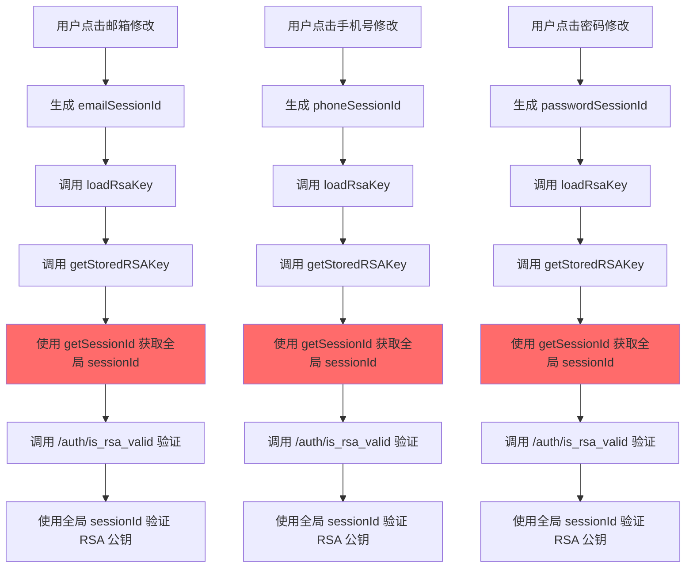
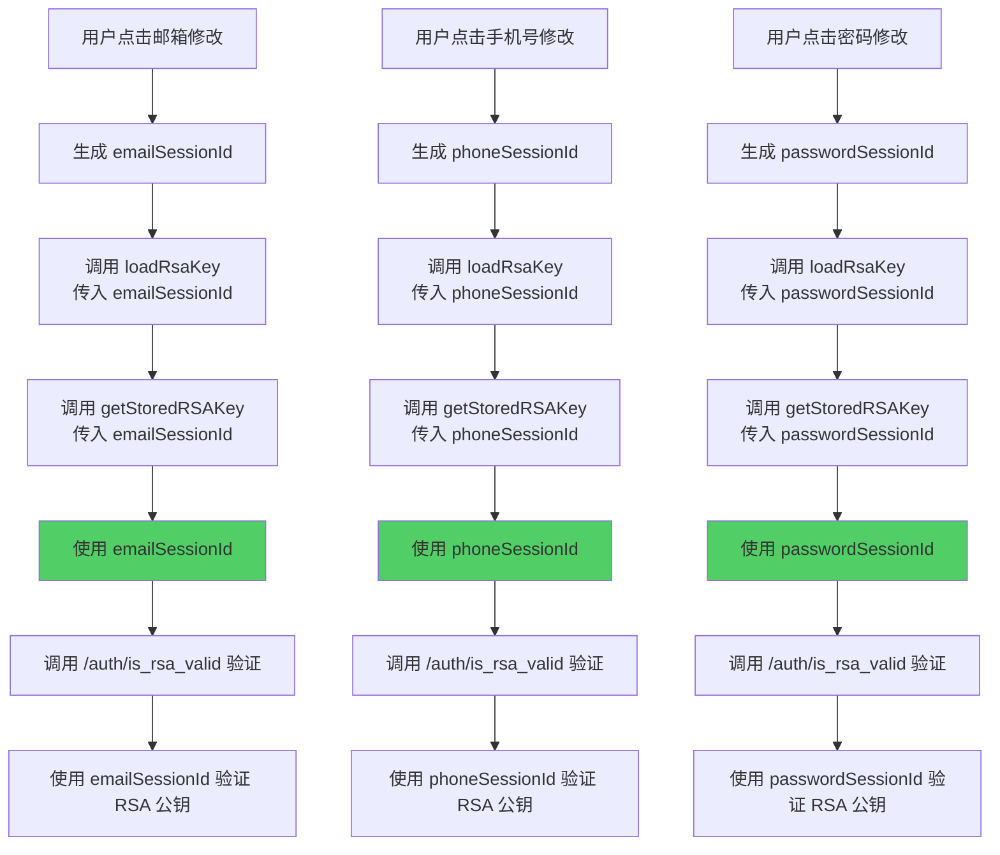

# RSA 公钥验证使用独立 SessionId 修复指南

## 🐛 问题描述

在 ProfileEditView 中，邮箱、手机号、密码修改时都会生成独立的 sessionId，但在获取和验证 RSA 公钥时，使用的是**全局的 sessionId**（通过 `getSessionId()` 获取），而不是每个模块独立的 sessionId。

这导致：
- ❌ 所有模块共用同一个 sessionId 来验证 RSA 公钥
- ❌ 无法实现真正的会话隔离
- ❌ 可能存在会话冲突和安全风险

---

## ✅ 修复方案

### 1. **修改 `getStoredRSAKey` 函数**

**文件**: `src/utils/rsa.js`  
**位置**: 第 77-137 行

#### 改造前

```javascript
export const getStoredRSAKey = async () => {
  try {
    logger.info('开始从 Cookie 读取并验证 RSA 公钥...')
    
    // 1. 从 Cookie 读取 publicKey
    const publicKey = getRSAPublicKeyFromCookie()
    
    if (!publicKey) {
      logger.info('Cookie 中没有 publicKey，需要重新获取')
      return null
    }
    
    logger.info('从 Cookie 读取到 publicKey (长度):', publicKey.length)
    
    // 2. 前端生成或读取 sessionId（❌ 总是使用全局 sessionId）
    const sessionId = getSessionId()
    logger.info('使用 sessionId:', sessionId)
    
    // 3. 调用 /auth/is_rsa_valid 验证
    // ...
  }
}
```

#### 改造后

```javascript
/**
 * 从 Cookie 读取 RSA 公钥并验证有效性
 * @param {string} customSessionId - 可选的自定义 sessionId（用于特定用途）
 * @returns {Promise<{publicKey: string, sessionId: string}|null>} 验证成功返回密钥对，失败返回 null
 */
export const getStoredRSAKey = async (customSessionId = null) => {
  try {
    logger.info('开始从 Cookie 读取并验证 RSA 公钥...')
    
    // 1. 从 Cookie 读取 publicKey
    const publicKey = getRSAPublicKeyFromCookie()
    
    if (!publicKey) {
      logger.info('Cookie 中没有 publicKey，需要重新获取')
      return null
    }
    
    logger.info('从 Cookie 读取到 publicKey (长度):', publicKey.length)
    
    // 2. 使用自定义 sessionId 或全局 sessionId（✅ 支持传入自定义 sessionId）
    const sessionId = customSessionId || getSessionId()
    logger.info('使用 sessionId:', sessionId, customSessionId ? '(自定义)' : '(全局)')
    
    // 3. 调用 /auth/is_rsa_valid 验证
    logger.info('正在验证 RSA 密钥有效性...')
    const response = await fetch(AUTH_API.VALIDATE_RSA, {
      method: 'POST',
      credentials: 'include',
      headers: {
        'Content-Type': 'application/json'
      },
      body: JSON.stringify({
        sessionId: sessionId,
        publicKey: decodeURIComponent(publicKey)
      })
    })
    
    if (!response.ok) {
      logger.warn('验证请求失败，HTTP 状态码:', response.status)
      return null
    }
    
    const data = await response.json()
    logger.debug('验证响应:', data)
    
    // 如果验证通过，返回公钥和 sessionId
    if (data.valid === true) {
      logger.info('RSA 密钥验证通过')
      
      // 重置 sessionId 有效期
      resetSessionIdExpiry()
      
      return {
        publicKey: decodeURIComponent(publicKey),
        sessionId: sessionId
      }
    } else {
      logger.info('RSA 密钥验证失败，需要重新获取')
      return null
    }
    
  } catch (error) {
    logger.error('验证 RSA 公钥时发生异常:', error)
    return null
  }
}
```

**改进**：
- ✅ 添加 `customSessionId` 参数（可选）
- ✅ 优先使用自定义 sessionId，如果没有则使用全局 sessionId
- ✅ 日志中区分使用的是自定义还是全局 sessionId

---

### 2. **修改 `loadRsaKey` 函数**

**文件**: `src/views/ProfileEditView.vue`  
**位置**: 第 1341-1373 行

#### 改造前

```javascript
const loadRsaKey = async () => {
  if (isRsaKeyLoading.value) {
    logger.debug('RSA 密钥正在加载中，跳过重复请求')
    return
  }
  
  isRsaKeyLoading.value = true
  
  try {
    logger.info('开始获取 RSA 公钥...')
    
    // 先尝试从 Cookie 读取并验证（❌ 没有传入 sessionId）
    const storedKey = await getStoredRSAKey()
    if (storedKey) {
      rsaPublicKey.value = storedKey.publicKey
      sessionId.value = storedKey.sessionId
      logger.info('RSA 密钥从 Cookie 加载并验证成功')
      return
    }
    
    // Cookie 中没有或验证失败，重新获取
    logger.info('Cookie 中无有效密钥，重新获取...')
    const keyData = await fetchRSAKey()
    rsaPublicKey.value = keyData.publicKey
    sessionId.value = keyData.sessionId
    logger.info('RSA 公钥获取成功')
  } catch (error) {
    logger.error('获取 RSA 公钥失败:', error)
    showError('系统初始化失败，请刷新页面重试')
  } finally {
    isRsaKeyLoading.value = false
  }
}
```

#### 改造后

```javascript
/**
 * 获取 RSA 公钥并保存到 Cookie
 * @param {string} purposeSessionId - 可选的特定用途 sessionId（用于邮箱、手机号、密码修改）
 */
const loadRsaKey = async (purposeSessionId = null) => {
  if (isRsaKeyLoading.value) {
    logger.debug('RSA 密钥正在加载中，跳过重复请求')
    return
  }
  
  isRsaKeyLoading.value = true
  
  try {
    logger.info('开始获取 RSA 公钥...', purposeSessionId ? `(使用特定用途 sessionId: ${purposeSessionId})` : '(使用全局 sessionId)')
    
    // 先尝试从 Cookie 读取并验证（✅ 传入特定用途的 sessionId）
    const storedKey = await getStoredRSAKey(purposeSessionId)
    if (storedKey) {
      rsaPublicKey.value = storedKey.publicKey
      sessionId.value = storedKey.sessionId
      logger.info('RSA 密钥从 Cookie 加载并验证成功')
      return
    }
    
    // Cookie 中没有或验证失败，重新获取
    logger.info('Cookie 中无有效密钥，重新获取...')
    const keyData = await fetchRSAKey()
    rsaPublicKey.value = keyData.publicKey
    sessionId.value = keyData.sessionId
    logger.info('RSA 公钥获取成功')
  } catch (error) {
    logger.error('获取 RSA 公钥失败:', error)
    showError('系统初始化失败，请刷新页面重试')
  } finally {
    isRsaKeyLoading.value = false
  }
}
```

**改进**：
- ✅ 添加 `purposeSessionId` 参数（可选）
- ✅ 将参数传递给 `getStoredRSAKey()`
- ✅ 日志中显示使用的是特定用途还是全局 sessionId

---

### 3. **修改 `startEdit` 函数**

**文件**: `src/views/ProfileEditView.vue`  
**位置**: 第 730-778 行

#### 改造前

```javascript
const startEdit = async (field) => {
  // ... 其他逻辑
  
  if (field === 'email') {
    editForm.value.email = userInfo.value.email || ''
    editForm.value.emailVerificationCode = ''
    emailSessionId.value = getOrCreatePurposeSessionId('email')
    logger.info('邮箱修改专用 sessionId:', emailSessionId.value)
    
    // 获取并验证 RSA 密钥（❌ 没有传入 sessionId）
    logger.info('开始获取 RSA 密钥用于邮箱修改...')
    await loadRsaKey()
  } else if (field === 'phone') {
    editForm.value.phone = userInfo.value.phone || ''
    editForm.value.phoneVerificationCode = ''
    phoneSessionId.value = getOrCreatePurposeSessionId('phone')
    logger.info('手机号修改专用 sessionId:', phoneSessionId.value)
    
    // 获取并验证 RSA 密钥（❌ 没有传入 sessionId）
    logger.info('开始获取 RSA 密钥用于手机号修改...')
    await loadRsaKey()
  } else if (field === 'password') {
    editForm.value.oldPassword = ''
    editForm.value.newPassword = ''
    editForm.value.confirmPassword = ''
    
    const passwordSessionId = getOrCreatePurposeSessionId('password')
    logger.info('密码修改专用 sessionId:', passwordSessionId)
    
    // 点击密码修改时，立即获取 RSA 密钥（❌ 没有传入 sessionId）
    logger.info('开始编辑密码，获取 RSA 密钥...')
    await loadRsaKey()
  }
}
```

#### 改造后

```javascript
const startEdit = async (field) => {
  // ... 其他逻辑
  
  if (field === 'email') {
    editForm.value.email = userInfo.value.email || ''
    editForm.value.emailVerificationCode = ''
    emailSessionId.value = getOrCreatePurposeSessionId('email')
    logger.info('邮箱修改专用 sessionId:', emailSessionId.value)
    
    // 获取并验证 RSA 密钥（✅ 使用邮箱专用 sessionId）
    logger.info('开始获取 RSA 密钥用于邮箱修改...')
    await loadRsaKey(emailSessionId.value)
  } else if (field === 'phone') {
    editForm.value.phone = userInfo.value.phone || ''
    editForm.value.phoneVerificationCode = ''
    phoneSessionId.value = getOrCreatePurposeSessionId('phone')
    logger.info('手机号修改专用 sessionId:', phoneSessionId.value)
    
    // 获取并验证 RSA 密钥（✅ 使用手机号专用 sessionId）
    logger.info('开始获取 RSA 密钥用于手机号修改...')
    await loadRsaKey(phoneSessionId.value)
  } else if (field === 'password') {
    editForm.value.oldPassword = ''
    editForm.value.newPassword = ''
    editForm.value.confirmPassword = ''
    
    const passwordSessionId = getOrCreatePurposeSessionId('password')
    logger.info('密码修改专用 sessionId:', passwordSessionId)
    
    // 点击密码修改时，立即获取 RSA 密钥（✅ 使用密码专用 sessionId）
    logger.info('开始编辑密码，获取 RSA 密钥...')
    await loadRsaKey(passwordSessionId)
  }
}
```

**改进**：
- ✅ 邮箱修改时传入 `emailSessionId.value`
- ✅ 手机号修改时传入 `phoneSessionId.value`
- ✅ 密码修改时传入 `passwordSessionId`

---

## 🔄 工作流程对比

### 改造前（错误）



**问题**：
- ❌ 三个模块都使用同一个全局 sessionId
- ❌ 无法实现会话隔离
- ❌ 可能存在会话冲突

### 改造后（正确）



**改进**：
- ✅ 每个模块使用自己独立的 sessionId
- ✅ 实现真正的会话隔离
- ✅ 避免会话冲突

---

## 📊 验证方法

### 1. 查看控制台日志

打开浏览器开发者工具 → Console，应该看到以下日志：

#### 邮箱修改

```
[ProfileEditView] 邮箱修改专用 sessionId: abc123-email
[ProfileEditView] 开始获取 RSA 密钥用于邮箱修改...
[RSA] 开始从 Cookie 读取并验证 RSA 公钥...
[RSA] 使用 sessionId: abc123-email (自定义)
[RSA] 正在验证 RSA 密钥有效性...
[RSA] RSA 密钥验证通过
```

#### 手机号修改

```
[ProfileEditView] 手机号修改专用 sessionId: def456-phone
[ProfileEditView] 开始获取 RSA 密钥用于手机号修改...
[RSA] 开始从 Cookie 读取并验证 RSA 公钥...
[RSA] 使用 sessionId: def456-phone (自定义)
[RSA] 正在验证 RSA 密钥有效性...
[RSA] RSA 密钥验证通过
```

#### 密码修改

```
[ProfileEditView] 密码修改专用 sessionId: ghi789-password
[ProfileEditView] 开始编辑密码，获取 RSA 密钥...
[RSA] 开始从 Cookie 读取并验证 RSA 公钥...
[RSA] 使用 sessionId: ghi789-password (自定义)
[RSA] 正在验证 RSA 密钥有效性...
[RSA] RSA 密钥验证通过
```

**关键点**：
- ✅ 日志中显示"(自定义)"而不是"(全局)"
- ✅ 每个模块使用不同的 sessionId

### 2. 检查 Network 面板

打开浏览器开发者工具 → Network：

1. 找到 `/api/auth/is_rsa_valid` 请求
2. 查看 Request Payload：

#### 邮箱修改时

```json
{
  "sessionId": "abc123-email",
  "publicKey": "-----BEGIN PUBLIC KEY-----..."
}
```

#### 手机号修改时

```json
{
  "sessionId": "def456-phone",
  "publicKey": "-----BEGIN PUBLIC KEY-----..."
}
```

#### 密码修改时

```json
{
  "sessionId": "ghi789-password",
  "publicKey": "-----BEGIN PUBLIC KEY-----..."
}
```

**验证点**：
- ✅ 每个请求使用不同的 sessionId
- ✅ sessionId 与模块对应（email/phone/password）

### 3. 检查 Cookie

在 Console 中运行：

```javascript
document.cookie
```

应该看到：

```
sessionId=global123; 
sessionId_email=abc123-email; 
sessionId_phone=def456-phone; 
sessionId_password=ghi789-password;
rsaPublicKey=...
```

**验证点**：
- ✅ 存在全局 sessionId
- ✅ 存在三个独立的 sessionId（email/phone/password）
- ✅ 每个 sessionId 有不同的值

---

## 🎯 关键改进

### 1. **会话隔离**

| 模块 | SessionId | 用途 |
|------|-----------|------|
| 全局 | `sessionId` | 登录、注册等通用操作 |
| 邮箱 | `sessionId_email` | 邮箱修改专用 |
| 手机号 | `sessionId_phone` | 手机号修改专用 |
| 密码 | `sessionId_password` | 密码修改专用 |

### 2. **安全性提升**

- ✅ 每个模块使用独立的 sessionId
- ✅ 防止会话冲突和重放攻击
- ✅ 一个 sessionId 泄露不会影响其他模块

### 3. **日志增强**

- ✅ 明确标识使用的是自定义还是全局 sessionId
- ✅ 便于调试和问题追踪
- ✅ 快速定位会话相关问题

---

## ⚠️ 注意事项

### 1. **向后兼容**

`getStoredRSAKey` 和 `loadRsaKey` 函数都添加了可选参数，默认值为 `null`：

```javascript
export const getStoredRSAKey = async (customSessionId = null) => { ... }
const loadRsaKey = async (purposeSessionId = null) => { ... }
```

这意味着：
- ✅ 如果不传参数，会使用全局 sessionId（保持向后兼容）
- ✅ 如果传参数，会使用自定义 sessionId（新功能）

### 2. **其他调用点**

检查是否有其他地方调用了 `loadRsaKey()`，确保它们也能正常工作：

```javascript
// ProfileEditView.vue 中的其他调用
const handleOldPasswordFocus = async () => {
  logger.info('当前密码框获得焦点，开始加载 RSA 密钥')
  await loadRsaKey()  // ✅ 不传参数，使用全局 sessionId（密码聚焦时）
}
```

这个调用是正确的，因为密码框聚焦时还没有生成 passwordSessionId，所以使用全局 sessionId 是合理的。

### 3. **RSA 公钥共享**

虽然每个模块使用独立的 sessionId 来验证 RSA 公钥，但 RSA 公钥本身是**共享的**（存储在 Cookie 中）：

- ✅ 所有模块使用同一个 RSA 公钥
- ✅ 不同模块使用不同的 sessionId 来验证
- ✅ 验证通过后都可以使用该公钥进行加密

这是合理的设计，因为：
- RSA 公钥本身就是公开的
- sessionId 用于会话管理和验证
- 分离了公钥管理和会话管理

---

## 📝 总结

### 修复内容

✅ 修改 `getStoredRSAKey` 函数，支持传入自定义 sessionId  
✅ 修改 `loadRsaKey` 函数，支持传入特定用途 sessionId  
✅ 修改 `startEdit` 函数，为每个模块传入对应的 sessionId  

### 效果

✅ 邮箱修改使用 `sessionId_email` 验证 RSA 公钥  
✅ 手机号修改使用 `sessionId_phone` 验证 RSA 公钥  
✅ 密码修改使用 `sessionId_password` 验证 RSA 公钥  
✅ 实现真正的会话隔离  
✅ 提升安全性  

### 验证

✅ 控制台日志显示"(自定义)"  
✅ Network 面板中看到不同的 sessionId  
✅ Cookie 中存在独立的 sessionId  

---

**最后更新**: 2026-05-01  
**版本**: v1.0  
**作者**: Lingma AI Assistant
